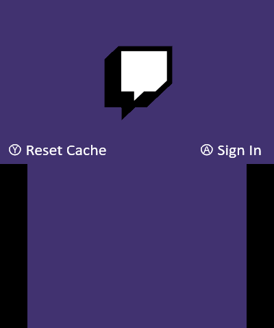
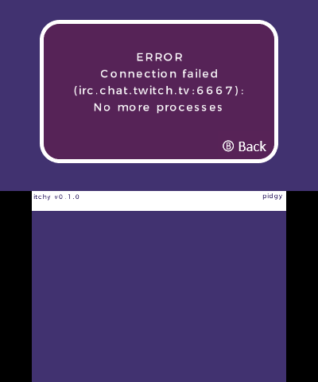

#   itchy 
Homebrew Twitch client for the Nintendo 3DS. 

## Features
- Currently only supports IRC chat viewing.
- Planned features:
    - Stream playback on the 3DS
    - Chat interactions
    - TBD

## Screenshots

 
 

## Building

- Requires [devkitPro](https://devkitpro.org/) tools for .3dsx development

#### VSCode
1. Add a custom MSYS2 terminal in VSCode
```
 "terminal.integrated.profiles.windows": {
        "Ubuntu (WSL)": {
            "path": "C:\\Windows\\System32\\wsl.exe"
        },
        "MSYS2 (devkitPro)": {
            "path": "C:/devkitPro/msys2/msys2_shell.cmd",
            "args": [
                "-defterm",
                "-here",
                "-no-start",
                "-msys",
            ],
        }
    },
```
2. Run ./deploy.bat from the custom MSYS2 profile.